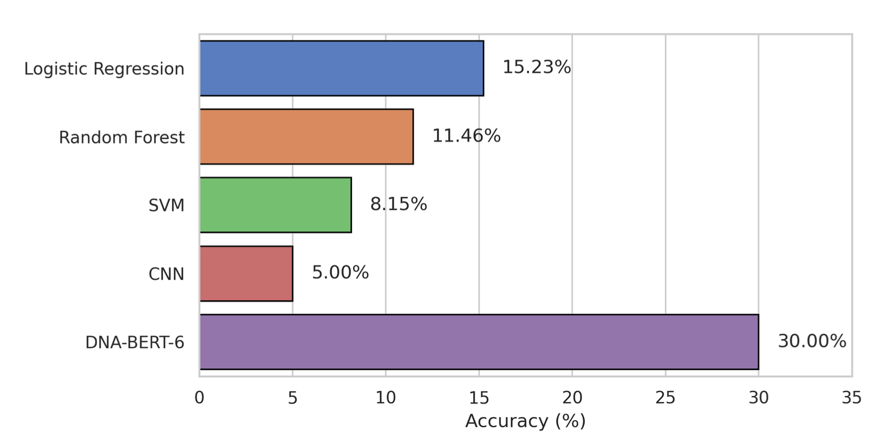

# Telopore
Using nanopore data to distinguish telomeric regions and their respective chromosomes

## Data pipeline

### Data pre-processing

`python telomere.py <reference genome>`

### Data simulation

Simulating long reads

F.Y.I NanoSim can only be run on Linux

Install
```
conda create -n nanosim_env
conda install -c bioconda nanosim
```

ex. 
``` 
simulator.py genome \
    --ref_g reference_set/CHM13_telomere.fasta \
    --model_prefix nanosim/human_giab_hg002_sub1M_kitv14_dorado_v3.2.1/training \
    --number 5000 \
    --output nanosim/telopore_sim_1_1000 \
    --num_threads 4
```

### Data post processing
`python src/sim_to_csv.py nanosim/telopore_sim_1_1000_aligned_reads.fasta nanosim/telopore_sim_2_1000_aligned_reads.fasta nanosim/telopore_sim_0_1000_aligned_reads.fasta out.csv`

## Results

Telomere Classification Accuracy
Our results, as illustrated in Figure 3a, show that the k-mer frequency analysis method significantly outperforms the linear regression approach for telomere classification (73% vs. 40% accuracy). Direct detection of repetitive k-mer sequences proves more effective at capturing telomeric repeats, while the linear regression approach struggles to account for the high density of repeats necessary for accurate classification.

K-mer Analysis
Figure 4 reveals that canonical telomeric repeats, such as “TTAGGG,” appear most frequently in telomeric regions, while subtelomeric and nontelomeric areas exhibit fewer occurrences of these motifs. Figure 3b reinforces these findings by showing the highest average repeat counts in telomeres, moderate levels in subtelomeres, and minimal repeats in nontelomeric sequences. This distribution confirms that repeat density is a critical feature for distinguishing telomeric from non-telomeric regions.


<!-- Figure 5: Chromosome Prediction Accuracy Comparison. -->

Chromosome Detection Accuracy
Our result shows that DNA-BERT-6 outperformed all other methods, achieving a 30% overall chromosome prediction accuracy compared to CNN (5%), SVM (8.15%), RF (11.46%), and LR (15.23%) in Figure 5. Despite this relatively modest global accuracy, DNA-BERT-6 showed significantly better performance (68% accuracy) on sub-telomeric regions, likely because these sequences were three times longer on average than telomeric or non-telomeric regions, thus providing more training examples. The model processes data by chunking each sequence into 512 bp windows, each further converted into 507 6-mer tokens, and then averaging logits across all sub-sequences during inference. However, this chunking strategy may bias the network toward features present in sub-telomeric sequences. For example, it sees substantially more sub-telomeric segments and can thus learn sub-telomeric features more effectively than those in telomeric or non-telomeric regions. Additionally, training calculates loss on each sub-sequence individually, rather than focusing on whole-sequence classification. To overcome these limitations, future work can employ architectures like BigBird or Longformer, which natively handle much longer inputs (10–50 kb), thus mitigating the need for extensive chunking. Furthermore, normalizing the sequence lengths across different genomic regions and refining the training objective to directly optimize for full-sequence classification will likely provide a more balanced view of chromosome-specific signals and yield improved prediction performance.

model download link which you can use with DNA_BERT/inference.py
https://drive.google.com/uc?export=download&id=17xNnHWqdKvy2pAI_mkVF_qfSaQvBNcKv

## Slides
https://docs.google.com/presentation/d/1h6-Foln7q_qHxyBhF11Qq3hanGS4dr5PLo51-a4265s/edit?usp=sharing
